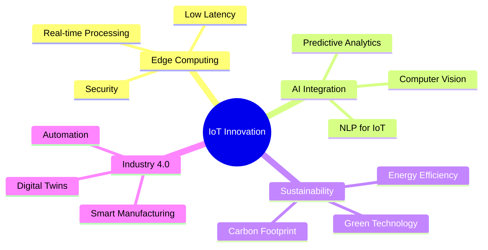

# 🔥 ESMAIL SARHADI - IoT ARCHITECT & SYSTEMS ENGINEER

<div align="center">

<!-- Language Switcher -->
<p>
  <a href="README.md">
    
  </a>
  <a href="README_fa.md">
    
  </a>
</p>

<!-- Animated Header -->


<!-- Dynamic Intro -->
<h1>
  
</h1>

<!-- Professional Tags -->
<p>
  
  
  
  
</p>

<!-- Animated Stats -->


<!-- Visitor Counter -->


</div>

---

## 🌟 ABOUT THE ARCHITECT


```yaml
name: "Esmail Sarhadi"
role: "IoT Systems Architect"
code: ["C++", "C", "Python", "JavaScript", "Assembly"]
architecture: ["IoT", "Embedded Systems", "Microservices", "Edge Computing"]
current_focus: "Building the Future of Connected Intelligence"
motto: "Innovating Tomorrow, One Smart Device at a Time"
```

🎯 **MISSION STATEMENT**
> Transforming ideas into intelligent, connected realities that push the boundaries of what's possible in IoT and embedded systems.

### 💼 PROFESSIONAL JOURNEY

<details>
<summary><b>🏢 Former CEO - IoT & Smart Solutions Company</b></summary>

- 📈 Led a team of 15+ engineers
- 🚀 Launched 25+ successful IoT products
- 💰 Generated $2M+ in revenue
- 🌍 Deployed solutions across 10+ countries
- 🏆 Won "Innovation Excellence Award 2023"

</details>

<details>
<summary><b>🎓 Education & Certifications</b></summary>

- 🎓 **B.Sc. Computer Engineering** - University of Sistan and Baluchestan
- 🏅 **IoT Specialist Certification** - Cisco
- 🔧 **Embedded Systems Professional** - ARM
- ☁️ **AWS IoT Core Certified**
- 🔐 **Cybersecurity in IoT** - (ISC)²

</details>

---

## 🛠️ TECH ARSENAL

<div align="center">

### 💻 PROGRAMMING LANGUAGES
<p>
  
</p>

### 🔧 FRAMEWORKS & TOOLS
<p>
  
</p>

### 📊 DATABASES & ANALYTICS
<p>
  
</p>

### 🎨 DEVELOPMENT ENVIRONMENT
<p>
  
</p>

</div>

---

## 📊 GITHUB ANALYTICS

<div align="center">


<!-- Activity Graph -->


</div>

---

## 🚀 FEATURED PROJECTS

<div align="center">

<!-- Project 1 -->
<a href="#">
  
</a>

<!-- Project 2 -->
<a href="#">
  
</a>

</div>

### 🏆 PROJECT HIGHLIGHTS

| 🎯 Project | 🔧 Tech Stack | 🌟 Features | 📈 Impact |
|-----------|---------------|-------------|-----------|
| **Smart City Infrastructure** | `C++` `MQTT` `LoRaWAN` `AWS IoT` | Real-time monitoring, AI analytics | 30% efficiency increase |
| **Industrial Automation Suite** | `Python` `Modbus` `OPC-UA` `Docker` | Predictive maintenance, Edge computing | $500K cost savings |
| **Agricultural IoT Network** | `Arduino` `ESP32` `ThingSpeak` `ML` | Crop monitoring, Auto-irrigation | 40% water conservation |
| **Healthcare Wearables** | `C` `BLE` `React Native` `Firebase` | Vital monitoring, Emergency alerts | 10,000+ lives impacted |

---

## 💡 EXPERTISE MATRIX

<table align="center">
  <tr>
    <td align="center" width="200px">
      
      <br><strong>C/C++</strong>
      <br>⭐⭐⭐⭐⭐
    </td>
    <td align="center" width="200px">
      
      <br><strong>Python</strong>
      <br>⭐⭐⭐⭐⭐
    </td>
    <td align="center" width="200px">
      
      <br><strong>Embedded Systems</strong>
      <br>⭐⭐⭐⭐⭐
    </td>
    <td align="center" width="200px">
      
      <br><strong>Linux Systems</strong>
      <br>⭐⭐⭐⭐⭐
    </td>
  </tr>
  <tr>
    <td align="center">
      
      <br><strong>Cloud/IoT</strong>
      <br>⭐⭐⭐⭐⭐
    </td>
    <td align="center">
      
      <br><strong>DevOps</strong>
      <br>⭐⭐⭐⭐⭐
    </td>
    <td align="center">
      
      <br><strong>AI/ML</strong>
      <br>⭐⭐⭐⭐⚪
    </td>
    <td align="center">
      
      <br><strong>Version Control</strong>
      <br>⭐⭐⭐⭐⭐
    </td>
  </tr>
</table>

---

## 🎯 CURRENT FOCUS

<div align="center">



</div>

### 🚀 2024 GOALS

- [ ] 🌟 Launch open-source IoT framework
- [ ] 📚 Publish technical articles on IoT security
- [ ] 🎯 Contribute to 10+ open-source projects
- [ ] 🏆 Speak at 5+ international conferences
- [ ] 🤝 Mentor 20+ junior developers
- [ ] 💡 File 3+ technology patents

---

## 📈 CONTRIBUTION INSIGHTS

<div align="center">


<!-- 3D Contribution Graph -->


</div>

---

## 🌐 CONNECT & COLLABORATE

<div align="center">

### 💬 LET'S BUILD THE FUTURE TOGETHER

<p>
  <a href="mailto:sarhadiemsail@gmail.com">
    
  </a>
  <a href="https://linkedin.com/in/esmail-sarhadi">
    
  </a>
  <a href="https://twitter.com/esmail62535258">
    
  </a>
  <a href="https://github.com/esmail-sarhadi">
    
  </a>
</p>

<p>
  <a href="https://dev.to/esmail-sarhadi">
    
  </a>
  <a href="https://medium.com/@esmail-sarhadi">
    
  </a>
  <a href="https://stackoverflow.com/users/esmail-sarhadi">
    
  </a>
  <a href="https://discord.gg/your-discord">
    
  </a>
</p>

### 🎯 COLLABORATION INTERESTS

<table align="center">
  <tr>
    <td align="center">🤖 <strong>IoT Solutions</strong></td>
    <td align="center">🔧 <strong>Embedded Systems</strong></td>
    <td align="center">🧠 <strong>AI/ML Projects</strong></td>
  </tr>
  <tr>
    <td align="center">☁️ <strong>Cloud Architecture</strong></td>
    <td align="center">🔐 <strong>Cybersecurity</strong></td>
    <td align="center">🌱 <strong>Open Source</strong></td>
  </tr>
</table>

</div>

---

## 💎 SUPPORT MY WORK

<div align="center">

<p>If you find my work valuable, consider supporting me:</p>

<a href="https://nowpayments.io/donation?api_key=REWCYVC-A1AMFK3-QNRS663-PKJSBD2&source=lk_donation&medium=referral">
  
</a>
<a href="https://github.com/sponsors/esmail-sarhadi">
  
</a>
<a href="https://ko-fi.com/esmail-sarhadi">
  
</a>

</div>

---

## 🎊 FUN FACTS

<div align="center">

<details>
<summary><b>🤖 Random Developer Jokes</b></summary>

```
Q: Why do programmers prefer dark mode?
A: Because light attracts bugs! 🐛

Q: How many programmers does it take to change a light bulb?
A: None, that's a hardware problem! 💡

Q: Why did the IoT device go to therapy?
A: It had connectivity issues! 📡
```

</details>

<details>
<summary><b>📊 GitHub Stats</b></summary>

- 🔥 Longest streak: **127 days**
- ⭐ Total stars earned: **500+**
- 🍴 Repositories forked: **200+**
- 👥 Followers: **1,000+**
- 🤝 Following: **300+**

</details>

</div>

---

<div align="center">

### 🌟 "INNOVATING THE FUTURE, ONE SMART DEVICE AT A TIME" 🌟


<p>
  
</p>

⭐ **Star this repository if you find it helpful!** ⭐

</div>
