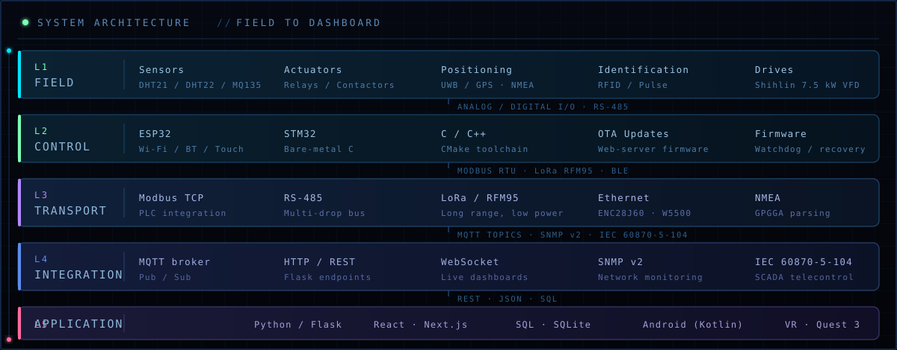

  

  

---





---



Most IoT profiles show a wall of logos. Here is the part that matters — the layer where things break.

- **Firmware that survives the field.** ESP32 and STM32 in bare-metal C/C++, with OTA update paths, watchdog recovery and web-server config UIs — because a device you have to drive to is a device that stays broken.
- **Protocol bridges.** Pulling data out of Modbus/RS-485 equipment, variable-frequency drives and legacy controllers, and getting it somewhere useful over MQTT, REST or WebSocket.
- **LoRa sensor networks.** Multi-node telemetry where there is no Wi-Fi and no power outlet — RFM95 links, central collection nodes, optional uplink to the cloud.
- **Industrial telemetry.** SNMP v2 agents on microcontrollers, NMEA/GPS ingestion, and IEC 60870-5-104 telecontrol for SCADA-side integration.
- **Operator dashboards.** Flask and React/Next.js front-ends for live data — designed for the person standing in front of the machine, not for a screenshot.

  



  



---



Every repository below is public. Star counts and languages are live from GitHub.

<table>
<thead>
<tr>
  <th width="34"></th>
  <th width="250">Project</th>
  <th>What it does</th>
  <th width="190">Stack</th>
</tr>
</thead>
<tbody>
<tr>
  <td><b>01</b></td>
  <td><a href="https://github.com/Esmail-sarhadi/esp32-ota-web-server"><b>esp32-ota-web-server</b></a> 
      </td>
  <td>Over-the-air firmware updates served from a web interface hosted on the ESP32 itself. Upload a binary, the device reboots into it. The pattern I reuse in every deployed product.</td>
  <td><code>C++</code> <code>ESP32</code> <code>OTA</code></td>
</tr>
<tr>
  <td><b>02</b></td>
  <td><a href="https://github.com/Esmail-sarhadi/phpserver-webserver-esp32"><b>phpserver-webserver-esp32</b></a> 
      </td>
  <td>Multi-sensor environmental station — DHT21 temperature/humidity, pulse sensor and MQ135 gas sensing — with the readings served from an on-device web interface.</td>
  <td><code>ESP32</code> <code>DHT21</code> <code>MQ135</code></td>
</tr>
<tr>
  <td><b>03</b></td>
  <td><a href="https://github.com/Esmail-sarhadi/heathguard"><b>heathguard</b></a> 
      </td>
  <td>Environmental and health monitoring platform. Sensor acquisition, thresholds, and an operator-facing view of the room the device is actually sitting in.</td>
  <td><code>ESP32</code> <code>Sensors</code></td>
</tr>
<tr>
  <td><b>04</b></td>
  <td><a href="https://github.com/Esmail-sarhadi/talking-skeleton"><b>talking-skeleton</b></a> 
      </td>
  <td>Animated anatomical model: per-organ LEDs, DFPlayer Mini audio narration and a moving jaw, driven over Bluetooth and RF, with a custom Android controller app.</td>
  <td><code>Kotlin</code> <code>ESP32</code> <code>DFPlayer</code></td>
</tr>
<tr>
  <td><b>05</b></td>
  <td><a href="https://github.com/Esmail-sarhadi/LoRa-ESP32-Communication"><b>LoRa-ESP32-Communication</b></a> 
      </td>
  <td>Reference implementation for LoRa links on ESP32 — setup, framing, send and receive. The starting point for the sensor networks that came after it.</td>
  <td><code>C++</code> <code>LoRa</code> <code>ESP32</code></td>
</tr>
<tr>
  <td><b>06</b></td>
  <td><a href="https://github.com/Esmail-sarhadi/Lora-Esp32-ThingSpeak"><b>Lora-Esp32-ThingSpeak</b></a> 
      </td>
  <td>Multi-node LoRa network where several transmitters report temperature and humidity to a central server, which processes the frames and optionally uplinks them to ThingSpeak.</td>
  <td><code>C++</code> <code>LoRa</code> <code>ThingSpeak</code></td>
</tr>
<tr>
  <td><b>07</b></td>
  <td><a href="https://github.com/Esmail-sarhadi/esp32_snmp"><b>esp32_snmp</b></a> 
      </td>
  <td>SNMP v2 agent running on an ESP32 over both Ethernet (ENC28J60) and Wi-Fi, so a microcontroller shows up as a first-class node in network monitoring.</td>
  <td><code>C++</code> <code>SNMP v2</code> <code>ENC28J60</code></td>
</tr>
<tr>
  <td><b>08</b></td>
  <td><a href="https://github.com/Esmail-sarhadi/Shihlin-drive"><b>Shihlin-drive</b></a> 
      </td>
  <td>RS-485 communications with a Shihlin SH040 7.5 kW variable-frequency drive — reading parameters and writing setpoints from a controller. Real industrial equipment, real register map.</td>
  <td><code>RS-485</code> <code>Modbus</code> <code>VFD</code></td>
</tr>
<tr>
  <td><b>09</b></td>
  <td><a href="https://github.com/Esmail-sarhadi/binary-encoding-visualization"><b>binary-encoding-visualization</b></a> 
      </td>
  <td>Python GUI that visualises line-coding schemes side by side: Unipolar, Polar NRZ-L/NRZ-I, Polar RZ, Manchester, Differential Manchester and AMI. Built to make a textbook chapter behave.</td>
  <td><code>Python</code> <code>Tkinter</code></td>
</tr>
<tr>
  <td><b>10</b></td>
  <td><a href="https://github.com/Esmail-sarhadi/ESP32-Smart-Touch-Control-System"><b>ESP32-Smart-Touch-Control-System</b></a> 
      </td>
  <td>Touch-sensing control with scheduling and real-time state synchronisation between the hardware and a responsive web UI — including dark mode, because of course.</td>
  <td><code>ESP32</code> <code>Touch</code> <code>Web UI</code></td>
</tr>
</tbody>
</table>

  

<b>More repositories worth a look</b>

 

| Repository | Why it exists |
|---|---|
| [**ESP32-NMEA-Generator-Decoder-Mqtt**](https://github.com/Esmail-sarhadi/ESP32-NMEA-Generator-Decoder-Mqtt) | Generates and parses NMEA sentences on-device, published over MQTT |
| [**IoT-Temperature-and-Humidity-Monitor-with-ESP32**](https://github.com/Esmail-sarhadi/IoT-Temperature-and-Humidity-Monitor-with-ESP32) | DHT21 monitoring with lamp control and CSV export from the browser |
| [**ESP32-BT-TempRelay**](https://github.com/Esmail-sarhadi/ESP32-BT-TempRelay) | Bluetooth telemetry plus relay control, no network required |
| [**SmartCool-IoT**](https://github.com/Esmail-sarhadi/SmartCool-IoT) | ESP32 evaporative-cooler controller with touch input and MQTT |
| [**esp32-ota-update-example**](https://github.com/Esmail-sarhadi/esp32-ota-update-example) | Minimal OTA update example, kept small on purpose |
| [**enc28j60-esp32-library**](https://github.com/Esmail-sarhadi/enc28j60-esp32-library) | Fixed and stabilised ENC28J60 Ethernet driver for ESP32 |
| [**Face-Recognition-Attendance-System**](https://github.com/Esmail-sarhadi/Face-Recognition-Attendance-System) | OpenCV + face_recognition attendance logging to CSV |
| [**Stock-Price-Prediction-using-SimpleRNN**](https://github.com/Esmail-sarhadi/Stock-Price-Prediction-using-SimpleRNN) | Recurrent network for time-series prediction |

---









<b>Contribution graph</b>

 

  

---



---



 

  

 

**Open to:** embedded firmware · industrial automation · Modbus/SCADA integration · LoRa sensor networks · IoT product builds

