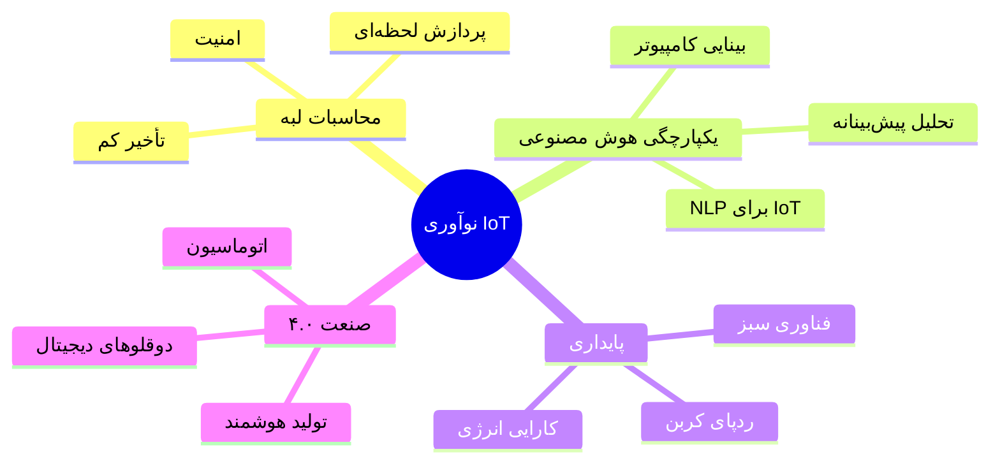

# 🔥 اسماعیل سرحدی - معمار IoT و مهندس سیستم‌ها

<div align="center">

<!-- Language Switcher -->
<p>
  <a href="README.md">
    
  </a>
  <a href="README_fa.md">
    
  </a>
</p>

<!-- Animated Header -->


<!-- Dynamic Intro -->
<h1>
  
</h1>

<!-- Professional Tags -->
<p>
  
  
  
  
</p>

<!-- Animated Stats -->


<!-- Visitor Counter -->


</div>

---

## 🌟 درباره معمار سیستم‌ها


```yaml
نام: "اسماعیل سرحدی"
نقش: "معمار سیستم‌های IoT"
کدها: ["C++", "C", "Python", "JavaScript", "Assembly"]
معماری: ["IoT", "Embedded Systems", "Microservices", "Edge Computing"]
تمرکز_فعلی: "ساخت آینده هوش متصل"
شعار: "نوآوری فردا، یک دستگاه هوشمند در هر زمان"
```

🎯 **بیانیه ماموریت**
> تبدیل ایده‌ها به واقعیت‌های هوشمند و متصل که مرزهای ممکن در IoT و سیستم‌های جاسازی شده را جابجا می‌کند.

### 💼 سفر حرفه‌ای

<details>
<summary><b>🏢 مدیرعامل سابق - شرکت راهکارهای هوشمند IoT</b></summary>

- 📈 رهبری تیم ۱۵+ مهندس
- 🚀 راه‌اندازی ۲۵+ محصول موفق IoT
- 💰 تولید درآمد بیش از ۲ میلیون دلار
- 🌍 استقرار راهکارها در ۱۰+ کشور
- 🏆 برنده "جایزه تعالی نوآوری ۲۰۲۳"

</details>

<details>
<summary><b>🎓 تحصیلات و گواهینامه‌ها</b></summary>

- 🎓 **کارشناسی مهندسی کامپیوتر** - دانشگاه سیستان و بلوچستان
- 🏅 **گواهی متخصص IoT** - Cisco
- 🔧 **متخصص سیستم‌های جاسازی شده** - ARM
- ☁️ **گواهی AWS IoT Core**
- 🔐 **امنیت سایبری در IoT** - (ISC)²

</details>

---

## 🛠️ ابزارخانه فناوری

<div align="center">

### 💻 زبان‌های برنامه‌نویسی
<p>
  
</p>

### 🔧 فریمورک‌ها و ابزارها
<p>
  
</p>

### 📊 پایگاه‌داده و تحلیل
<p>
  
</p>

### 🎨 محیط توسعه
<p>
  
</p>

</div>

---

## 📊 تحلیل‌های گیت‌هاب

<div align="center">


<!-- Activity Graph -->


</div>

---

## 🚀 پروژه‌های ویژه

<div align="center">

<!-- Project Cards would go here - these are placeholder examples -->
<a href="#">
  
</a>

<a href="#">
  
</a>

</div>

### 🏆 نکات برجسته پروژه‌ها

| 🎯 پروژه | 🔧 پشته فناوری | 🌟 ویژگی‌ها | 📈 تأثیر |
|-----------|---------------|-------------|-----------|
| **زیرساخت شهر هوشمند** | `C++` `MQTT` `LoRaWAN` `AWS IoT` | نظارت لحظه‌ای، تحلیل هوش مصنوعی | افزایش ۳۰٪ کارایی |
| **مجموعه اتوماسیون صنعتی** | `Python` `Modbus` `OPC-UA` `Docker` | نگهداری پیش‌بینانه، محاسبات لبه | صرفه‌جویی ۵۰۰ هزار دلار |
| **شبکه IoT کشاورزی** | `Arduino` `ESP32` `ThingSpeak` `ML` | نظارت محصولات، آبیاری خودکار | صرفه‌جویی ۴۰٪ آب |
| **پوشیدنی‌های سلامت** | `C` `BLE` `React Native` `Firebase` | نظارت حیاتی، هشدارهای اضطراری | تأثیر بر ۱۰ هزار نفر |

---

## 💡 ماتریس تخصص

<table align="center">
  <tr>
    <td align="center" width="200px">
      
      <br><strong>C/C++</strong>
      <br>⭐⭐⭐⭐⭐
    </td>
    <td align="center" width="200px">
      
      <br><strong>Python</strong>
      <br>⭐⭐⭐⭐⭐
    </td>
    <td align="center" width="200px">
      
      <br><strong>سیستم‌های جاسازی</strong>
      <br>⭐⭐⭐⭐⭐
    </td>
    <td align="center" width="200px">
      
      <br><strong>سیستم‌های لینوکس</strong>
      <br>⭐⭐⭐⭐⭐
    </td>
  </tr>
  <tr>
    <td align="center">
      
      <br><strong>Cloud/IoT</strong>
      <br>⭐⭐⭐⭐⭐
    </td>
    <td align="center">
      
      <br><strong>DevOps</strong>
      <br>⭐⭐⭐⭐⭐
    </td>
    <td align="center">
      
      <br><strong>AI/ML</strong>
      <br>⭐⭐⭐⭐⚪
    </td>
    <td align="center">
      
      <br><strong>کنترل نسخه</strong>
      <br>⭐⭐⭐⭐⭐
    </td>
  </tr>
</table>

---

## 🎯 تمرکز فعلی

<div align="center">



</div>

### 🚀 اهداف ۲۰۲۴

- [ ] 🌟 راه‌اندازی فریمورک IoT متن‌باز
- [ ] 📚 انتشار مقالات فنی درباره امنیت IoT
- [ ] 🎯 مشارکت در ۱۰+ پروژه متن‌باز
- [ ] 🏆 سخنرانی در ۵+ کنفرانس بین‌المللی
- [ ] 🤝 راهنمایی ۲۰+ توسعه‌دهنده جوان
- [ ] 💡 ثبت ۳+ پتنت فناوری

---

## 📈 بینش‌های مشارکت

<div align="center">


<!-- 3D Contribution Graph -->


</div>

---

## 🌐 اتصال و همکاری

<div align="center">

### 💬 بیایید آینده را با هم بسازیم

<p>
  <a href="mailto:sarhadiemsail@gmail.com">
    
  </a>
  <a href="https://linkedin.com/in/esmail-sarhadi">
    
  </a>
  <a href="https://twitter.com/esmail62535258">
    
  </a>
  <a href="https://github.com/esmail-sarhadi">
    
  </a>
</p>

<p>
  <a href="https://dev.to/esmail-sarhadi">
    
  </a>
  <a href="https://medium.com/@esmail-sarhadi">
    
  </a>
  <a href="https://stackoverflow.com/users/esmail-sarhadi">
    
  </a>
  <a href="https://discord.gg/your-discord">
    
  </a>
</p>

### 🎯 علایق همکاری

<table align="center">
  <tr>
    <td align="center">🤖 <strong>راهکارهای IoT</strong></td>
    <td align="center">🔧 <strong>سیستم‌های جاسازی</strong></td>
    <td align="center">🧠 <strong>پروژه‌های AI/ML</strong></td>
  </tr>
  <tr>
    <td align="center">☁️ <strong>معماری ابری</strong></td>
    <td align="center">🔐 <strong>امنیت سایبری</strong></td>
    <td align="center">🌱 <strong>متن‌باز</strong></td>
  </tr>
</table>

</div>

---

## 💎 حمایت از کارم

<div align="center">

<p>اگر کار من را ارزشمند می‌یابید، از من حمایت کنید:</p>

<a href="https://nowpayments.io/donation?api_key=REWCYVC-A1AMFK3-QNRS663-PKJSBD2&source=lk_donation&medium=referral">
  
</a>
<a href="https://github.com/sponsors/esmail-sarhadi">
  
</a>
<a href="https://ko-fi.com/esmail-sarhadi">
  
</a>

</div>

---

## 🎊 حقایق جالب

<div align="center">

<details>
<summary><b>🤖 شوخی‌های برنامه‌نویس</b></summary>

```
سوال: چرا برنامه‌نویسها حالت تاریک را ترجیح می‌دهند؟
جواب: چون نور باگ جذب می‌کند! 🐛

سوال: چند برنامه‌نویس برای تعویض لامپ لازم است؟
جواب: هیچ‌کدام، این مسئله سخت‌افزاری است! 💡

سوال: چرا دستگاه IoT به روانشناس رفت؟
جواب: مشکل اتصال داشت! 📡
```

</details>

<details>
<summary><b>📊 آمار گیت‌هاب</b></summary>

- 🔥 طولانی‌ترین نوار: **۱۲۷ روز**
- ⭐ مجموع ستاره‌ها: **۵۰۰+**
- 🍴 مخازن فورک شده: **۲۰۰+**
- 👥 دنبال‌کنندگان: **۱۰۰۰+**
- 🤝 دنبال شده: **۳۰۰+**

</details>

</div>

---

<div align="center">

### 🌟 "نوآوری آینده، یک دستگاه هوشمند در هر زمان" 🌟


<p>
  
</p>

⭐ **اگر این مخزن مفید بود، ستاره بدهید!** ⭐

</div>
